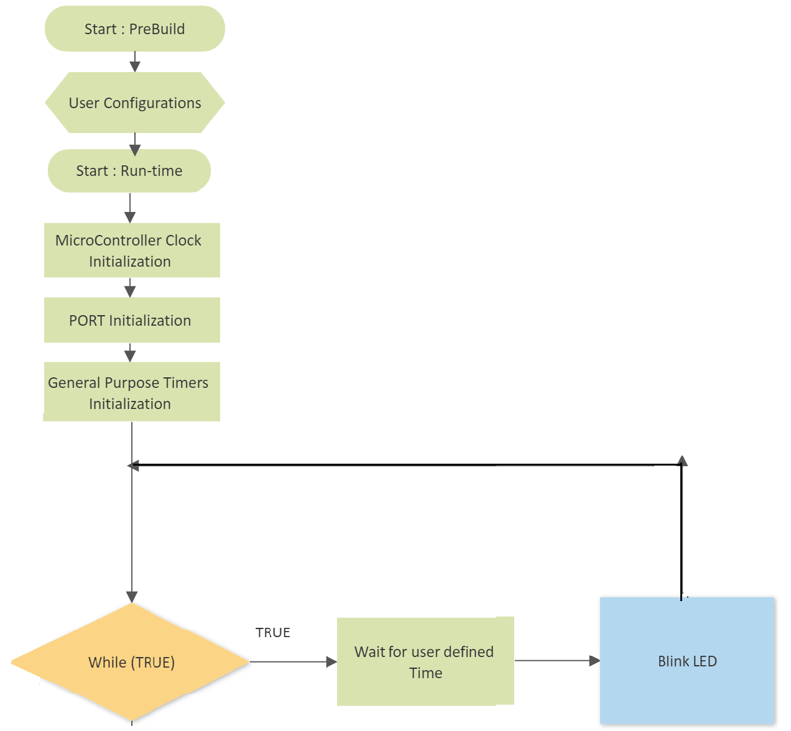

# LED Control For TivaC

This project allows users to control the blinking of an LED with user-defined ON and OFF periods.  
The project utilizes the timer module to control the LED blinking without relying on predefined delay functions. The LED is turned on for the specified ON time and dimmed during the OFF time, achieving the effect of PWM using timer overflow.

### Block Diagram 

    

### Main
Create a function in the App layer that takes as an input from the user a
specific ON time and OFF time in seconds, lights a LED for the given ON
time, and dim it for the given OFF time. 

## Implemented Drivers

    

### GPIO_Program.c
1. Created the GPIO driver from scratch using the sufficient
interface,configure,private and program files
2. Created functions in GPIO driver that are needed to perform the
required project functionality
3. Separated pin control as a separat module **PORT_Program.c**:
    This module initializes each GPIO pin in microcontroller, By looping over each port and each pin and set it with configured functionality. 
    **Configurations** PORT_Configure.h : In This project , we initialized portf pin0,pin4 as pulled up input, and pin1,pin2,pin3 as output.

### IntCtrl_Program.c
Interrrupt Control Driver 
1. Created the Interrupt driver from scratch using the sufficient
interface,configure,private and program files
2. Created functions in Interrupt driver that are needed to perform the
required project functionality.  

**Configurations** IntCtrl_Configure.h : configured IntCtrl_InterruptCfg struct with required functionalities.

### GPT_Program.c
1. Created the Timer driver from scratch using the sufficient
interface,configure,private and program files
2. Created functions in Timer driver that are needed to perform the
required project functionality
3. Created a Timer Overflow ISR that performs the required
functionality
4. Successfully Passed the ISR as a callback function from App Layer to Timer driver
in MCAL layer
**Configurations** GPT_Configure.h: configured GPT_ConfigArray struct with for each Channel the required Tick Frequency, Max Tick Value, and Channel Mode.
